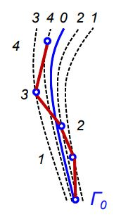
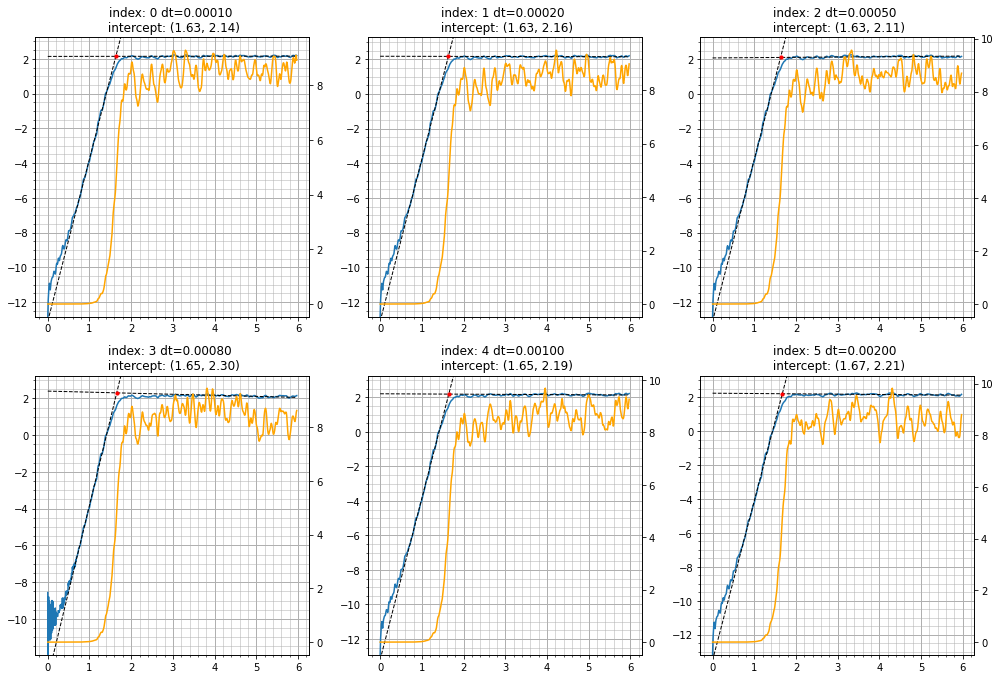

## Introduction

This paper considers a system of particles interacting with each other in terms of the Lennard-Jones potential.

Due to the Lyapunov instability, Newtonian trajectories calculated from close points of the phase space diverge exponentially with time. The same pattern of divergence can also be expected for molecular dynamics (MD) trajectories wandering along Newtonian trajectories.

Due to the discontinuity of numerical integration, the simulated system is not ideal. Let $\Gamma_0$ be a point in $6N$-dimensional phase space. The sides of the broken line in figure 1 can become larger or smaller depending on the integration step. Although two systems are integrated from the same state, there appears to be a difference between the speeds and coordinates of the particles during the integration process. This phenomenon is called trajectory divergence.

Let $( \textbf{r}_i (t) , \textbf{v}_i (t) )$ denote the 1st and $( \textbf{r}_i^{'} (t) , \textbf{v} _i^{'} (t) )$ - 2nd trajectory. Consider the trajectory-averaged differences in the coordinates (and velocities) of the first and second trajectories at coinciding times $t = (k \Delta t) = (k^{'} \Delta t^{'})$ for any $k, k^{'} \in \mathbb{N}$:

$$ \overline{\Delta r^{2} (t)} = \frac{1}{N} \sum_{n=1}^{N} ( \textbf{r}_ (t) - \textbf{r}_i^{'} (t))^{2} $$

$$ \overline{\Delta v^{2} (t)} = \frac{1}{N} \sum_{n=1}^{N} ( \textbf{v}_i (t) - \textbf{v}_i^{'} (t))^{2} $$

They increase exponentially over time:

$$ \overline{\Delta r^{2} (t)} = A \cdot exp(Kt) , t_l < t < t_m$$

$$ \overline{\Delta v^{2} (t)} = B \cdot exp(Kt) , t_l < t < t_m$$

where $t_l$ is some transition time (on the order of the reciprocal frequency of interparticle collisions), $A$ , $B$ and $t_l$ depend on the numerical scheme, $\Delta t$ and $\Delta t^{'}$ -integration steps. K - the value of K-entropy (Krylov-Kolmogorov entropy, averaged over the phase space). After the time $t_m$, the systems become completely independent, and the graphs of the above dependencies begin to behave differently (the system enters diffusion mode). This work is devoted to determining the value $t_m$ of the observable system. It is called "dynamic memory time". The measurement method is based on determining a point on the graph, after which the nature of the dependence changes.

## Parameters of the simulated system

We will investigate a system that is in a liquid state. Below are the calculation parameters in the Lennard-Jonsya units system:

Number of particles - $200$

Temperature - $1.4$ (L-J units)

Density - $0.65$ (L-J units)

Cutoff radius - $3$ (L-J units)

Computational area - cubic

Boundary conditions - periodic (actively used in modeling such physical systems)

## Results

To illustrate, let's present graphs of $\overline{\Delta v^{2} (t)}$
and its logarithm, which compares a system with a time step $dt = 0.005$ (L-J units) with systems that have time steps $dt = 0.0001, 0.0002, 0.0005, 0.0008, 0.001, 0.002$ (L-J units).

In the graphs below, the x-axes represent time; the orange graphs are $\overline{\Delta v^{2} (t)}$, the blue graphs are $\ln ( \overline{\Delta v^{2} (t)} )$ for different integration steps.

	
As we can see, the obtained results are consistent with our expectations from theoretical considerations. First, in the graph of the logarithm of $\overline{\Delta v^{2} (t)}$, two different dependencies are visible before and after the time equal to the dynamic memory time; each blue curve can be approximated as a combination of 2 lines. Second, by taking into account that the blue line is a logarithmic graph, we ensure that the exponential nature of $\overline{\Delta v^{2} (t)}$ holds with high precision (slanted line)․ The second line (diffusion mode) shows the independence of the two systems, they completely forgot their initial state. And finally, it can be noted that everywhere the logarithms of $\overline{\Delta v^{2} (t)}$ go to the same constant, which means the same final temperature.

As a result, we get the following values for the dynamic memory time: 1.704, 1.701, 1.714, 1.686, 1.715, 1.730 (L-J units). Note that all values are pretty close, which is expected since the integration time steps are very small everywhere. This indicates that the experiment was performed accurately.
And finally, we get the dynamic memory time of our system.

$t_m = 1.71 ± 0.01$ (L-J units)

